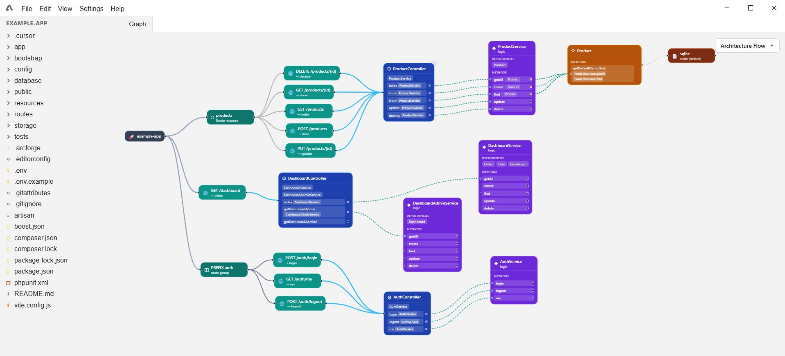
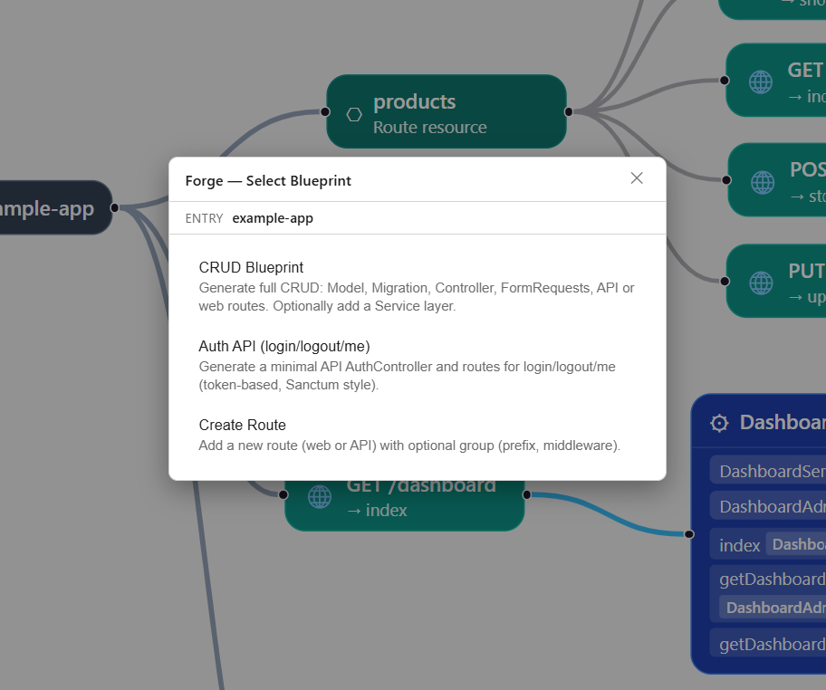
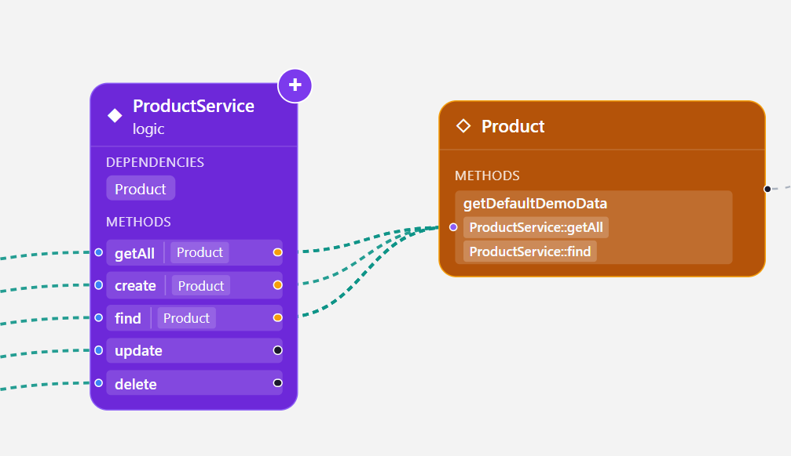

## Arcforge

**Graph-based IDE and architecture explorer for backend projects.**

Arcforge turns your backend into a navigable graph: controllers, services, models, and their dependencies become nodes and edges you can explore, understand, and refactor with more confidence.

- 🔍 **See your backend as a graph**, not as isolated files
- 🧭 **Trace request flows** across controllers, services, and data layers
- 📂 **Open any node to the real code** that powers it
- 🧱 **Design and evolve architectures** without losing track of how everything connects

> **Open Beta** · Windows desktop · Currently focused on **Laravel** backends.  
> **Planned next language:** Golang.

### Screenshots

  <strong>Graph view</strong> 
  

  <strong>Add blueprint</strong> 
  

  <strong>Add new logic</strong> 
  

---

### What Arcforge is good for

- **Architecture exploration**
  - Understand unfamiliar Laravel projects quickly
  - Onboard new team members with a visual map of the system
- **Refactoring with context**
  - See what depends on what before you touch code
  - Avoid breaking hidden paths and side effects
- **Communication**
  - Use the graph to explain backend flows to other engineers, tech leads, and stakeholders

> **Important**  
> The current Open Beta is best suited for **viewing and understanding projects**, especially small-to-medium codebases.  
> It is **not recommended** to rely on this version to edit or refactor **very large production projects** end-to-end.

Arcforge will **not modify your code automatically** during normal usage; it reads and indexes your project to build the graph.

---

### Status

- **Stage:** Open Beta
- **Platform:** Windows (x64)
- **Supported stack:** Laravel (PHP)
- **Next integration (planned):** Golang

Updates are distributed via:

- GitHub Releases, and
- a static `updates.json` manifest served from the Arcforge website.

The desktop app simply checks the manifest on startup to see whether a newer version is available.  
There are **no background services, telemetry, or tracking**.

---

### Download

- **[Latest Windows build (.zip)](https://github.com/ysz7/Arcforge/releases/latest)**
- **[Direct link for v1.0.1 (.zip)](https://github.com/ysz7/Arcforge/releases/download/v1.0.1/Arcforge-1.0.1.zip)**

---

### How it works (high level)

1. **Scan & index**
   - Point Arcforge at your Laravel project.
   - The app parses controllers, services, models, and key routing / dependency information.

2. **Build the graph**
   - Nodes represent backend units (controllers, services, models, etc.).
   - Edges describe relationships and call chains between those units.

3. **Explore**
   - Click through nodes to:
     - see connections,
     - trace paths across the graph,
     - open the **actual code** behind a node in the built-in viewer.

4. **Iterate on your architecture**
   - Use the graph to plan refactors or new features.
   - Keep mental overhead low by navigating visually rather than hunting through files.

---

### Safety & limits in Open Beta

- Arcforge focuses on **reading and visualizing** your codebase.
- It is **safe to use for inspection** of existing projects.
- For now, consider it a **companion for understanding and planning**, not a full-blown refactoring engine for massive production monoliths.

If you run into edge cases or performance issues on large projects, please share feedback with project details (size, tech stack, symptoms).

---

### License

See the `LICENSE` file for details.