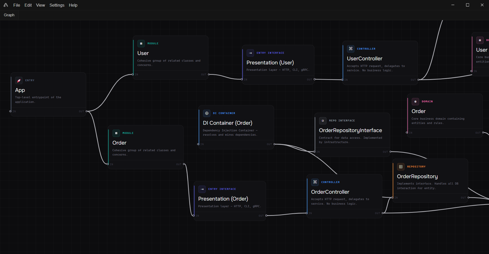
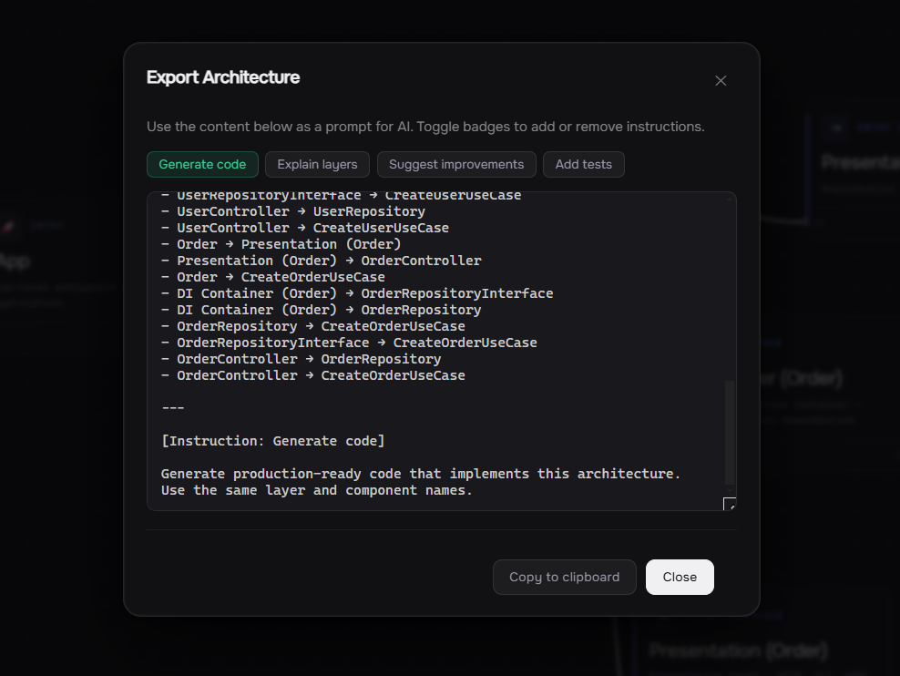

<h2> Arcforge</h2>

**Graph-based IDE and architecture explorer for backend projects.**

Arcforge turns your backend into a navigable graph: controllers, services, models, and their dependencies become nodes and edges you can explore, understand, and refactor with more confidence.

- ⬡ **Graph-first backend view** — controllers, services, models, and relations as one navigable graph
- `</>` **Open node, read code** — click any node to jump to the exact source file and line
- ⟶ **Trace request flows** — follow a request from HTTP entry through middleware, services, to the database
- ✦ **Design with Arcspec** — design architecture from scratch and export AI-ready prompts for any language
- 🔌 **Plugin-powered** — every language adapter is a plugin; install official or community plugins, or build your own
- 🛡 **Safer refactors** — explore all dependencies before touching code

> **Open Beta** · Windows desktop · Plugin SDK open for community contributions

---

### Screenshots

  <strong>Graph view</strong> 
  

  <strong>Save as prompt</strong> 
  

---

### Plugins

Arcforge is built around a plugin system. A plugin is a folder with three files:

| File | Purpose |
|---|---|
| `manifest.json` | Metadata, `accepts` (directory/file), `capabilities` flags |
| `nodes.js` | Node type definitions — shape, color, icon |
| `parser.js` | `async parse(input)` — returns nodes and edges |

**Official plugins:**
- [**Laravel**](https://github.com/ysz7/Arcforge/tree/main/plugins/laravel) — Models, Controllers, Routes, Views, Migrations
- **Arcspec Designer** — free-form architecture design, exports AI-ready prompts (`.arcspec.json`)

**Build your own:** grab the SDK templates and AI prompt from [`/SDK`](https://github.com/ysz7/Arcforge/tree/main/SDK).

> ⚠️ Plugins run with full Node.js access to your file system. **Only install plugins from sources you trust.**

---

### Status

> **Open Beta** · **Windows (x64)** · **v1.3.0**

Updates are distributed via GitHub Releases and a static `updates.json` manifest checked on startup.
There are **no background services, telemetry, or tracking**.

---

### Download

- **[Latest Windows build (.zip)](https://github.com/ysz7/Arcforge/releases/latest)**
- **[Direct link for v1.3.0 (.zip)](https://github.com/ysz7/Arcforge/releases/download/v1.3.0/Arcforge-1.3.0.zip)**

---

### Safety & limits in Open Beta

- Arcforge focuses on **reading and visualizing** your codebase — it will not modify your code automatically.
- Best suited for **understanding and planning**, especially small-to-medium projects.
- For very large production monoliths, performance may vary — share feedback with project details if you hit issues.

---

### License

See the `LICENSE` file for details.
